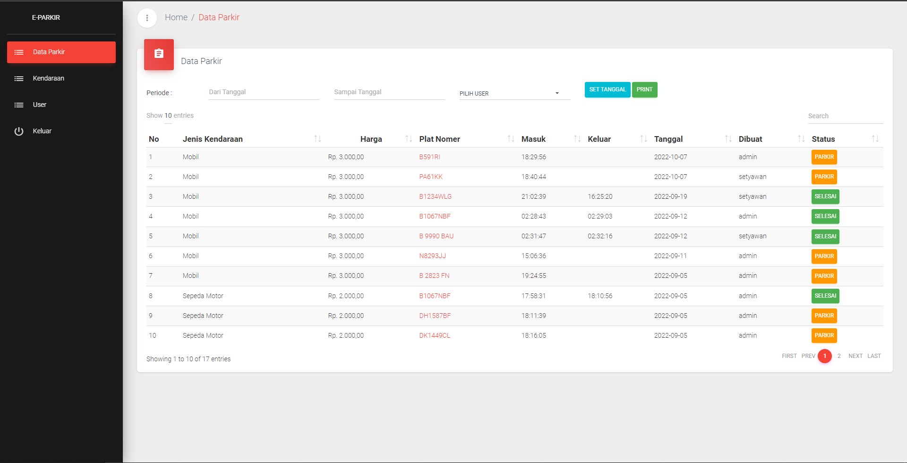

# E Parkir

E-Parkir dibuat untuk mempercepat proses pencetakan dan pengecekan karcis parkir, aplikasi
ini juga dilengkapi dengan sistem keamanan pendataan kendaraan. Dengan adanya
database yang diunggah di internet makan cadangan data kendaraan akan masih
ada di server. Penulis juga menggunakan fitur Text Recognition pada penambahan
data parkir jadi dengan adanya sistem tersebut makan pengetikan yang sebelumnya
dilakukan secara manual berubah dengan hanya mengambil foto atau gambar dari
kendaraan maka secara otomatis plat nomor dari kendaraan yang difoto akan
langsung terbaca oleh sistem dan petugas hanya perlu merubah sedikit isi dari hasil
pemindaian foto tersebut. Aplikasi E-Parkir juga mempunyai sistem manajemen
pengelolaan pendapatan untuk petugas parkir yang disediakan di website E-Parkir
dengan data yang diambil dari lapangan oleh petugas parkir. 

## Screenshots Project Android

#### Login

#### Home

#### Add Data Parkir

#### Add Data With Scanner 

#### Ticket Out

#### List Data

#### Scan Ticet

#### Bill

#### List Keluar Page 

#### Search

#### Logout

## Screenshots Project Website

#### Login

#### Homepage

#### Report

#### Biaya Jenis Kendaraan

#### User

